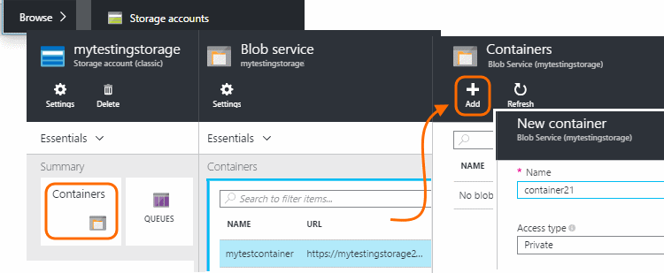
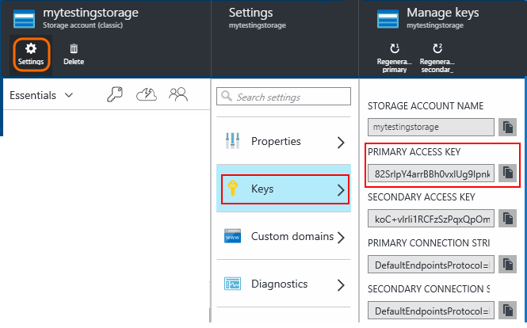
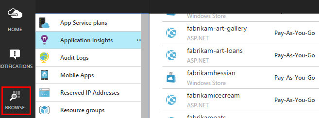
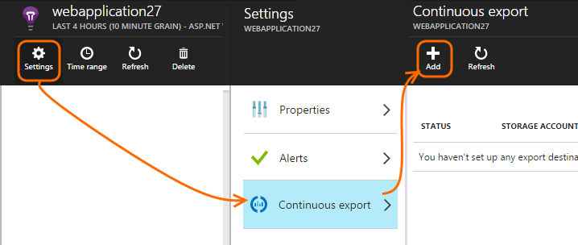
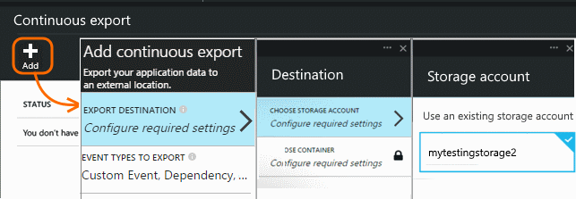
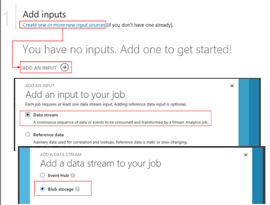
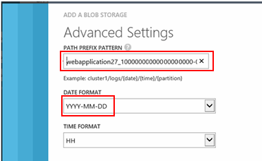
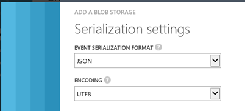
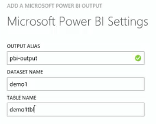
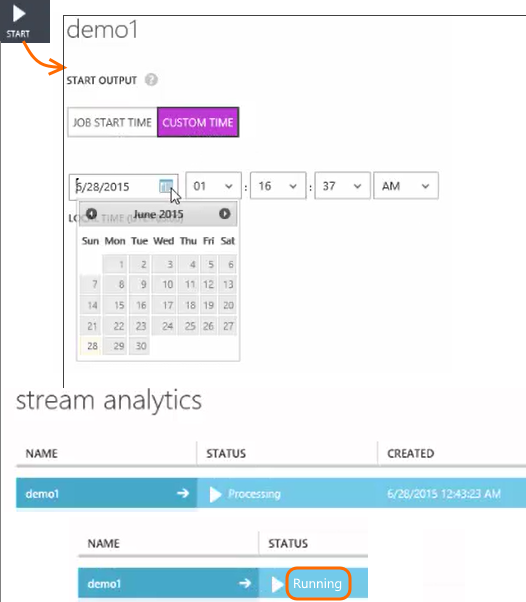

<properties 
	pageTitle="Export to Power BI from Application Insights" 
	description="Articles " 
	services="application-insights" 
    documentationCenter=""
	authors="noamben" 
	manager="douge"/>

<tags 
	ms.service="application-insights" 
	ms.workload="tbd" 
	ms.tgt_pltfrm="ibiza" 
	ms.devlang="na" 
	ms.topic="article" 
	ms.date="04/05/2016" 
	ms.author="awills"/>

# Feed Power BI from Application Insights

[Power BI](http://www.powerbi.com/) is a suite of business analytics tools to analyze data and share insights. Rich dashboards are available on every device. You can combine data from many sources, including from [Visual Studio Application Insights](app-insights-overview.md).

To get started, see [Display Application Insights data in Power BI](https://powerbi.microsoft.com/documentation/powerbi-content-pack-application-insights/).

You get an initial dashboard that you can customize, combining the Application Insights charts with those of other sources. There's a visualization gallery where you can get more charts, and each chart has a parameters you can set.


After the initial import, the dashboard and the reports continue to update daily. You can control the refresh schedule on the dataset.


**Sampling.** If your application sends a lot of data and you are using the Application Insights SDK for ASP.NET version 2.0.0-beta3 or later, the adaptive sampling feature may operate and send only a percentage of your telemetry. The same is true if you have manually set sampling either in the SDK or on ingestion. [Learn more about sampling.](app-insights-sampling.md)

## Alternative ways to see Application Insights data

* [Azure Dashboards containing Application Insights charts](app-insights-dashboards.md) may be more appropriate if you don't need to show non-Azure data. For example, if you want to set up a dashboard of Application Insights charts monitoring different components of a system, perhaps together with some Azure service monitors, then an Azure dashboard is ideal. It updates more frequently by default. 
* [Continuous export](app-insights-export-telemetry.md) copies your incoming data to Azure storage, from where you can move and process it however you like.
* [Analytics](app-insights-analytics.md) lets you perform complex queries on the raw data retained by Application Insights.


## Create your own Power BI adaptor using Stream Analytics

The Power BI content pack for Application Insights displays a useful subset of your app's telemetry that will probably be sufficient for your needs. But if you'd like to get a broader range of telemetry than it provides, or if you'd like to compute some data from the raw telemetry, then you can create your own adapter using the Azure Stream Analytics service.

In this scheme, we'll export data from Application Insights to Azure Storage. [Stream Analytics](https://azure.microsoft.com/services/stream-analytics/) will pull the data from there, rename and process some of the fields, and pipe it into Power BI. Stream Analytics is a service that can filter, aggregate and perform computations on a continuous stream of data.


>[AZURE.TIP] **You don't need to follow the procedure in the rest of this article** (using Stream Analytics) to see Application Insights data in Power BI. There's a much easier way! ([Use the free adapter](https://powerbi.microsoft.com/documentation/powerbi-content-pack-application-insights/) instead. Follow the rest of this article only if that adapter doesn't provide all the data you want, or if you want to define your own aggregations or functions over your data. 

### Create storage in Azure

Continuous export always outputs data to an Azure Storage account, so you need to create the storage first.

1. Did you try the [Power BI powerpack for Application Insights](https://powerbi.microsoft.com/documentation/powerbi-content-pack-application-insights/)? If it's sufficient for your needs, then you don't need anything in the rest of this article.

2.  Create a "classic" storage account in your subscription in the [Azure portal](https://portal.azure.com).

    

2. Create a container

    

3. Copy the storage access key

    You'll need it soon to set up the input to the stream analytics service.

    

### Start continuous export to Azure storage

[Continuous export](app-insights-export-telemetry.md) moves data from Application Insights into Azure storage.

1. In the Azure portal, browse to the Application Insights resource you created for your application.

    

2. Create a continuous export.

    


    Select the storage account you created earlier:

    
    
    Set the event types you want to see:

    

3. Let some data accumulate. Sit back and let people use your application for a while. Telemetry will come in and you'll see statistical charts in [metric explorer](app-insights-metrics-explorer.md) and individual events in [diagnostic search](app-insights-diagnostic-search.md). 

    And also, the data will export to your storage. 

4. Inspect the exported data. In Visual Studio, choose **View / Cloud Explorer**, and open Azure / Storage. (If you don't have this menu option, you need to install the Azure SDK: Open the New Project dialog and open Visual C# / Cloud / Get Microsoft Azure SDK for .NET.)

    

    Make a note of the common part of the path name, which is derived from the application name and instrumentation key. 

The events are written to blob files in JSON format. Each file may contain one or more events. So we'd like to read the event data and filter out the fields we want. There are all kinds of things we could do with the data, but our plan today is to use Stream Analytics to pipe the data to Power BI.

### Create an Azure Stream Analytics instance

From the [Classic Azure Portal](https://manage.windowsazure.com/), select the Azure Stream Analytics service, and create a new Stream Analytics job:


When the new job is created, expand its details:


#### Set blob location

Set it to take input from your Continuous Export blob:



Now you'll need the Primary Access Key from your Storage Account, which you noted earlier. Set this as the Storage Account Key.


#### Set path prefix pattern 




Be sure to set the Date Format to YYYY-MM-DD (with dashes).

The Path Prefix Pattern specifies where Stream Analytics finds the input files in the storage. You need to set it to correspond to how Continuous Export stores the data. Set it like this:

    webapplication27_12345678123412341234123456789abcdef0/PageViews/{date}/{time}

In this example:

* `webapplication27` is the name of the Application Insights resource **all lower case**.
* `1234...` is the instrumentation key of the Application Insights resource, **omitting dashes**. 
* `PageViews` is the type of data you want to analyze. The available types depend on the filter you set in Continuous Export. Examine the exported data to see the other available types, and see the [export data model](app-insights-export-data-model.md).
* `/{date}/{time}` is a pattern written literally.

> [AZURE.NOTE] Inspect the storage to make sure you get the path right.

#### Finish initial setup

Confirm the serialization format:



Close the wizard and wait for the setup to complete.

> [AZURE.TIP] Use the Sample command to download some data. Keep it as a test sample to debug your query.

### Set the output

Now select your job and set the output.


Provide your **work or school account** to authorize Stream Analytics to access your Power BI resource. Then invent a name for the output, and for the target Power BI dataset and table.



### Set the query

The query governs the translation from input to output.


Use the Test function to check that you get the right output. Give it the sample data that you took from the inputs page. 

#### Query to display counts of events

Paste this query:

```SQL

    SELECT
      flat.ArrayValue.name,
      count(*)
    INTO
      [pbi-output]
    FROM
      [export-input] A
    OUTER APPLY GetElements(A.[event]) as flat
    GROUP BY TumblingWindow(minute, 1), flat.ArrayValue.name
```

* export-input is the alias we gave to the stream input
* pbi-output is the output alias we defined
* We use [OUTER APPLY GetElements](https://msdn.microsoft.com/library/azure/dn706229.aspx) because the event name is in a nested JSON arrray. Then the Select picks the event name, together with a count of the number of instances with that name in the time period. The [Group By](https://msdn.microsoft.com/library/azure/dn835023.aspx) clause groups the elements into time periods of 1 minute.


#### Query to display metric values


```SQL

    SELECT
      A.context.data.eventtime,
      avg(CASE WHEN flat.arrayvalue.myMetric.value IS NULL THEN 0 ELSE  flat.arrayvalue.myMetric.value END) as myValue
    INTO
      [pbi-output]
    FROM
      [export-input] A
    OUTER APPLY GetElements(A.context.custom.metrics) as flat
    GROUP BY TumblingWindow(minute, 1), A.context.data.eventtime

``` 

* This query drills into the metrics telemetry to get the event time and the metric value. The metric values are inside an array, so we use the OUTER APPLY GetElements pattern to extract the rows. "myMetric" is the name of the metric in this case. 

#### Query to include values of dimension properties

```SQL

    WITH flat AS (
    SELECT
      MySource.context.data.eventTime as eventTime,
      InstanceId = MyDimension.ArrayValue.InstanceId.value,
      BusinessUnitId = MyDimension.ArrayValue.BusinessUnitId.value
    FROM MySource
    OUTER APPLY GetArrayElements(MySource.context.custom.dimensions) MyDimension
    )
    SELECT
     eventTime,
     InstanceId,
     BusinessUnitId
    INTO AIOutput
    FROM flat

```

* This query includes values of the dimension properties without depending on a particular dimension being at a fixed index in the dimension array.

### Run the job

You can select a date in the past to start the job from. 



Wait until the job is Running.

### See results in Power BI

Open Power BI with your work or school account, and select the dataset and table that you defined as the output of the Stream Analytics job.


Now you can use this dataset in reports and dashboards in [Power BI](https://powerbi.microsoft.com).


### Video

Noam Ben Zeev shows how to export to Power BI.

> [AZURE.VIDEO export-to-power-bi-from-application-insights]

## Related stuff

* [Continuous export](app-insights-export-telemetry.md)
* [Detailed data model reference for the property types and values.](app-insights-export-data-model.md)
* [Application Insights](app-insights-overview.md)
* [More samples and walkthroughs](app-insights-code-samples.md)
 
